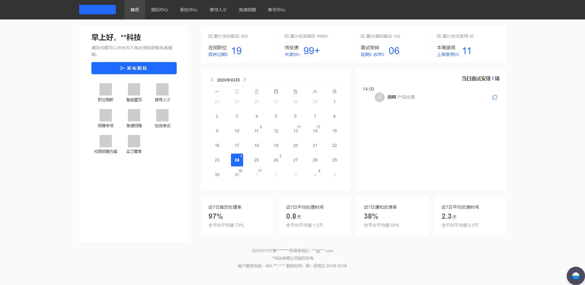
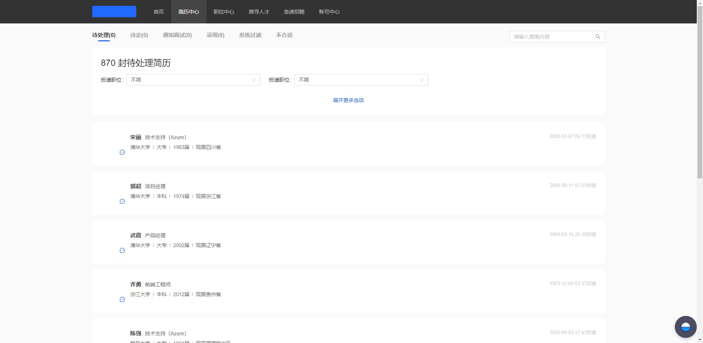
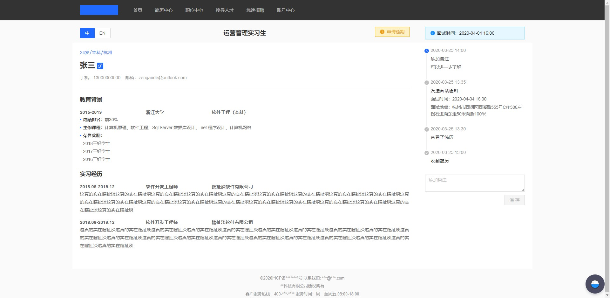

# 招聘网站HR中心
项目使用 [ReactJS](https://react.docschina.org/)、[UmiJS](https://umijs.org/)、[Ant Design](https://ant.design/) 等，对关于 ReactJS 开发有更深刻的了解，请勿商用！
*UI参考[实习僧HR中心改版项目-YoyoChiang](https://www.ui.cn/detail/485995.html)*
## 页面




## Getting Started

Install dependencies,

```bash
$ yarn
```

Start the dev server,

```bash
$ yarn start
```
